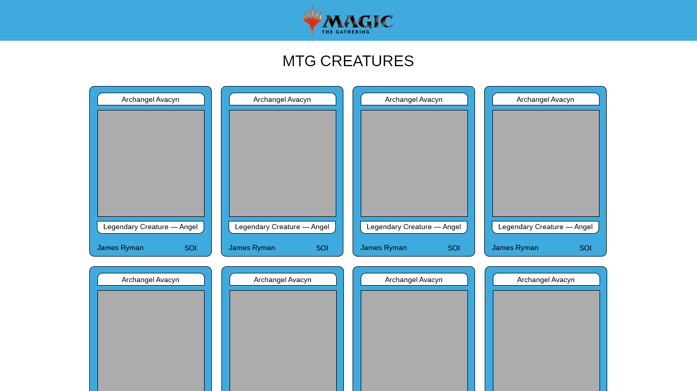

# Process
1. Set-up environment:
   1. Used: `create-react-app`
   2. Added: `Eslint` with Google guidelines
   3. Added: `gulp` for task automation
   4. Added: `gulp-imagemin` plugin for minifying images.
   5. Added: `api.http` for testing provided REST API with the help of VS Code `REST Client` extension.
2. Development:
   1. Added: logo for the app (minified -6.1% in size) and new favicon.ico
      * 
      * 
   2. Created: basic mockup for the page in Photoshop ro meet the following requirements:
      * Display the results in a "card" format, where the cards flow from left to right across the width of the screen and then down to the next row creating as many rows as necessary.
      * Each card should display: image, name, artist, set name, and original type. You may also display additional fields.
      * Include a page header. You may also include additional layout elements at your discretion.
      * 
  3. Separated design into the following components within `<App/>`:
      * `Header` with the logo
      * `Main` that contains page title, `Cards`, `Card`, `Loader`